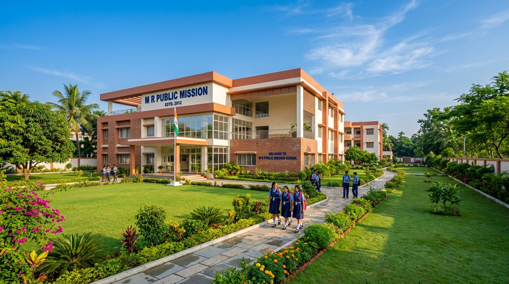

# M.R. PUBLIC MISSION - Modern Bilingual School Web Portal



A modern, responsive, and bilingual (English & Bengali / বাংলা) web portal for **M.R. PUBLIC MISSION**, a premier Bengali Medium school in India (Classes: Nursery/Class 0 to Class V).

---

## 🌟 Key Features

- **🎨 Modern Aesthetic Design**: Professional educational theme using royal blue (`#0A346C`), vibrant warm orange (`#EA580C`), and crisp white typography.
- **🌐 100% Bilingual Support**: Seamless dynamic language switcher between **English** and **Bengali (বাংলা)** across all content, notices, buttons, and portals.
- **🏫 Comprehensive Academic Showcase**:
  - Class 0 (Nursery/KG) to Class V curriculum structure.
  - Smart classrooms, computer lab, library, sports & cultural activity highlights.
  - Interactive Admission Open banner & dynamic online application modal.
  - Downloadable Prospectus preview modal with instant print capability.
- **💻 Interactive Portals Simulator**:
  - **Parent Portal**: Real-time student attendance summary, homework tracker, downloadable digital report cards, and fee receipts.
  - **Teacher Portal**: One-click student attendance toggle, assignment publisher, and exam marks entry.
  - **Admin Dashboard**: Live school metrics, financial overview, staff directory, and circular broadcasting.
- **🔔 Notice Board & Quick Search**: Live filterable announcements and search functionality.
- **📱 Fully Responsive**: Optimized for smartphones, tablets, laptops, and ultra-wide desktops.
- **♿ Fast & Accessible**: Pure Vanilla JavaScript and CSS with zero heavy runtime dependencies.

---

## 🚀 Getting Started

### 1. Prerequisites
No complex installation required! The website runs directly in any modern web browser or lightweight HTTP server.

### 2. Run Locally with Python
```bash
# Navigate to the project root directory
cd mr-public-mission

# Start a local HTTP server
python -m http.server 8085
```
Open [http://localhost:8085](http://localhost:8085) in your web browser.

### 3. Run with Node.js / npx
```bash
npx serve .
```

---

## 📁 Project Structure

```text
mr-public-mission/
├── index.html              # Main single-page application & semantic layout
├── css/
│   ├── style.css           # Modern design system, animations & responsive grid
│   └── print.css           # Print stylesheet for prospectus & report cards
├── js/
│   ├── app.js              # Interactivity, portal simulator, modal controllers
│   ├── data.js             # School curriculum, notices, achievements & mock portal data
│   └── translations.js     # Comprehensive English & Bengali localization dictionary
├── assets/
│   └── images/             # High-resolution campus, classroom, cultural & sports images
│       ├── hero-campus.jpg
│       ├── classroom.jpg
│       ├── principal.jpg
│       ├── sports.jpg
│       └── cultural.jpg
├── .gitignore
└── README.md
```

---

## 🏫 About M.R. PUBLIC MISSION
- **Curriculum**: Bengali Medium (WBBSE aligned foundation)
- **Levels**: Nursery / Class 0 to Class V
- **Motto**: "Nurturing Young Minds with Knowledge, Values, and Culture"
- **Contact**: info@mrpublicmission.edu.in | +91 98765 43210
- **Location**: West Bengal, India

---

## 📄 License
This project is licensed under the MIT License.
